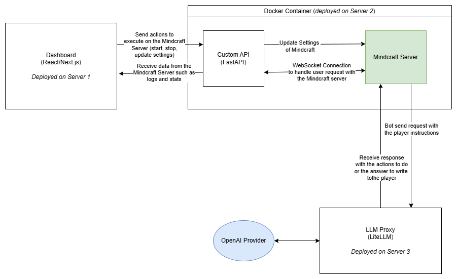
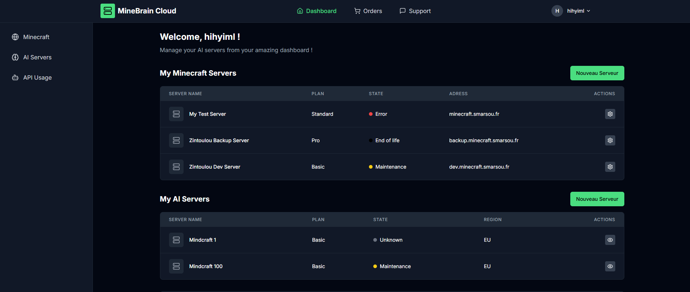
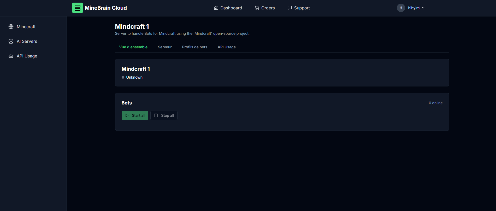

# AI Bots Multitenant Manager

Ce dépot sert à mettre en avant mes compétences dans le cadre de ma candidature à un poste d'AI Engineer. Le projet étant privé, le code ne sera pas entièrement partagé directement en publique. Une démonstration pourra être réalisé avec plus de détails sur l'implémentation à la demande du recruteur.

## Contexte

**Mindcraft** est un projet open source qui est activement en développement. Ce projet, accessible dans le dépot [ici](https://github.com/kolbytn/mindcraft) est un serveur nodejs qui connecte et contrôle un bot autonome sur un serveur Minecraft. La spécificité de ce projet est que le bot communique avec un LLM pour communiquer avec les joueurs présent sur le jeu, permettant ainsi de répondre aux instructions des joueurs et de choisir les actions à réaliser en conséquences.

Le problème que j'ai rencontré est que l'installation et la configuration de ce serveur n'est pas encore assez simple pour qu'un joueur lambda de Minecraft puisse profiter de ce projet. M'est alors venu l'idée de développer un service permettant de déployer un serveur **Mindcraft** pour chaque utilisateur en quelques cliques.

## Objectif

L'objectif est donc d'implémenter un service complet permettant de déployer et de gérer un serveur Mindcraft fonctionelle à la demande d'un utilisateur.

Cela implique les fonctionnalités suivantes :
- Déployer un serveur Mindcraft sur internet
- Connecter le serveur Mindcraft avec un LLM
- Limiter l'accès au modèle LLM pour chaque utilisateur (pour éviter les excès de coûts)
- Contrôler le serveur Mindcraft depuis une interface web

## Architecture

Pour répondre aux besoins cités dans la partie objectif. J'ai donc choisis de mettre en place un architecture comme présenté ci-dessous.

### 1. Les différents serveurs

Tout d'abord, j'utilise 3 différents serveurs Linux pour cette architecture.
- Serveur 1 : Héberge le dashboard.
- Serveur 2 : Héberge les serveurs Mindcraft des utilisateurs.
- Serveur 3 : Héberge le Proxy LLM.

### 2. Un Conteneur Docker contenant Mindcraft et une API Custom

Le serveur Mindcraft est déployé à côté d'une API Custom que j'ai implémentée en Python avec FastAPI.

Cette API Custom permet un contrôle à distance contrôlé et sécurisé du serveur Mindcraft :
- Démarrer, arrêter le serveur Mindcraft
- Mettre à jour les fichiers de configurations
- Envoyer des messages aux bots directement depuis le serveur

Vous pouvez retrouvez l'implémentation de cette API Custom directement dans le dossier `custom_api`.

### 3. Le Dashboard

Le dashboard est une application web implémenté avec React et Next.js. Ce dashboard communique directement avec l'API Custom pour gérer le serveur. 

Voici de captures d'écran illustrant le dashboard en cours de développement : 

 
Figure 1 - Page principale du dashboard, présentant les différents serveurs Minecraft et serveur IA Mindcraft

 
Figure 2 - Page de détail d'un serveur Mindcraft, contenant plusieurs onglets pour la gestion du serveurs Mindcraft.

### 4. Le Proxy LLM

Ce proxy est un projet open-source appelé [*LiteLLM*](https://github.com/BerriAI/litellm) qui est déployable facilement avec docker.

Celui-ci permet dans ce projet de contrôler l'accès pour chaque utilisateur à mes ressources API chez OpenAI. 

Ainsi, je peux définir des limites pour chaque utilisateur, contrôler la consommation et définir des règles d'accès à l'API.